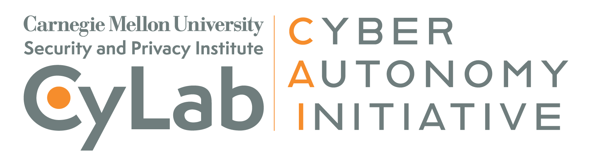

The CyLab CyberAutonomy Initiative is a research initiative led by Carnegie Mellon's [Security and Privacy Institute](https://www.cylab.cmu.edu/), focused on providing the scientific foundations for the future of autonomous cybersecurity.

This site serves as a location for researchers and policymakers to view data, access code, meet the team, and get involved.

More information can be found in the [CyberAutonomy whitepaper](https://doi.org/10.1184/R1/31769038) and at our [CyLab homepage](https://www.cylab.cmu.edu/research/cyber-autonomy-initiative/index.html)